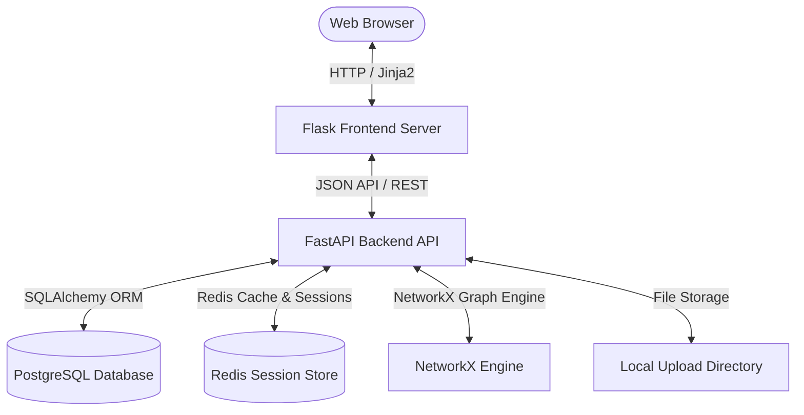
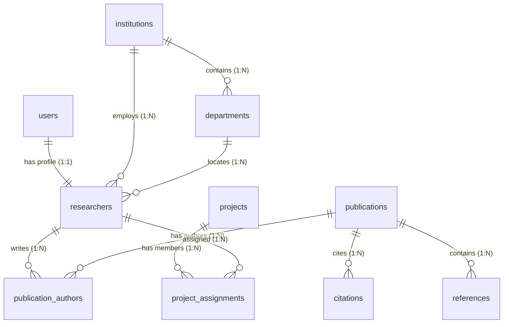

# Scientific Collaboration Network Analyzer: Presentation & Specifications Guide

This document provides a comprehensive explanation of the project's technical architecture, component specifications, and step-by-step instructions for demonstrating the system in your presentation.

---

## 1. Executive Summary
The **Scientific Collaboration Network Analyzer (SCNA)** is a modern research management and graph analytics platform. It helps universities, research labs, and academic institutions to:
* **Catalog Co-authorship Networks**: Map who is publishing papers with whom.
* **Track Funding & Grants**: Monitor research projects, budgets, and team allocations.
* **Visualize Relationships**: Use interactive graph visualization (force-directed graphs) to explore academic collaborations.
* **Generate Analytical Reports**: Export multi-sheet Excel workbooks and polished PDF summary reports.

---

## 2. Technical Architecture & Stack

The application follows a **microservices-inspired multi-tier architecture** containerized via Docker.



### Component Specifications
1. **Frontend Web UI (Flask & Jinja2)**
   * **Port**: `5050` (Docker container maps internal `5000` to external `5050`)
   * **Technologies**: Python 3.13, Flask, Jinja2 Templates, Vanilla CSS (with custom Glassmorphism Panels), and **Vis.js** for frontend graph rendering.
   * **Role**: Acts as a client gateway, serving responsive web interfaces and proxying request payloads to the backend API.
2. **Backend REST API (FastAPI)**
   * **Port**: `8001` (Docker container maps internal `8000` to external `8001`)
   * **Technologies**: Python 3.13, FastAPI, Uvicorn, SQLAlchemy ORM, Alembic Migrations, Pydantic validation schemas.
   * **Role**: Houses all business logic, authentication (JWT tokens), file processing, metrics logging, and graph compute engines.
3. **Database (PostgreSQL 16)**
   * **Port**: `5432`
   * **Role**: Persistent transactional storage for all relational entities (Users, Researchers, Publications, Projects, Collaborations).
4. **Session Cache (Redis 7)**
   * **Port**: `6379`
   * **Role**: Key-value caching for sessions, rate-limiting, and temporary state coordination.
5. **Container Orchestration (Docker & Docker Compose)**
   * Manages container linking, environment injection, health checks, and persistent volumes for uploads and database storage.

---

## 3. Core Features & Logical Implementation

### A. Dynamic Collaboration Graph Engine (The Visual Highlight)
The platform uses **NetworkX** on the backend and **Vis.js** on the frontend to construct the co-authorship map.

* **Nodes (Researchers)**:
  * **Size**: Proportional to the researcher's total number of publications (`value = publication_count + 5`).
  * **Color/Group**: Grouped by the researcher's institution ID.
  * **Hover Information**: Displays full name, department, institution, and research interests.
* **Edges (Collaborations)**:
  * **Weight**: Determines line thickness. 
  * **Co-authorship**: Each shared publication increases the edge weight by `1.0`.
  * **Explicit Projects/Collaborations**: Increases the edge weight by `1.5`.

#### Backend Implementation Snippet:
```python
# Create graph
G = nx.Graph()

# Add nodes (Researchers)
for r in researchers:
    G.add_node(
        r.id,
        label=r.full_name,
        value=len(r.publication_relations) + 5, # Node scaling
        group=r.institution_id or 0
    )

# Add edges (Co-authorship)
for pub_id, author_ids in pub_to_authors.items():
    for i in range(len(author_ids)):
        for j in range(i + 1, len(author_ids)):
            u, v = author_ids[i], author_ids[j]
            if G.has_edge(u, v):
                G[u][v]["weight"] += 1
            else:
                G.add_edge(u, v, weight=1)
```

### B. Analytical Reports Generator
The system utilizes server-side streaming to construct downloadable files:
* **Multi-Sheet Excel (`.xlsx`)**: Generated using `openpyxl`. It splits data into 4 clean sheets: *Researchers*, *Publications*, *Projects*, and *Collaborations*.
* **Executive Summary PDF (`.pdf`)**: Generated using `reportlab`. It compiles live database counts, styling headers, table layouts, and formats aggregate analytics using a polished typographic style.

---

## 4. Database Schema Relationships



---

## 5. Live Demonstration Script (Step-by-Step)

Follow this flow during your presentation to showcase the system effectively:

### Step 1: User Authentication & Role Management
* **Action**: Open [http://localhost:5050](http://localhost:5050). Log in using `admin@scna.org` with password `admin`.
* **Explanation**: Explain that the system bootstraps this account automatically on startup, utilizing **FastAPI OAuth2 password flow** with **JWT access and refresh tokens**. Mention the separate views for System Admins, Institutional Admins, and Researchers.

### Step 2: Dashboard Analytics
* **Action**: Point out the dashboard cards showing:
  * Total Researchers
  * Total Publications
  * Total Projects & Funding Amount
  * Collaboration count
* **Explanation**: Explain that these widgets are fetched via the `/dashboards/admin` API endpoint and are dynamically computed using SQL database aggregation.

### Step 3: Scientific Collaboration Network (The "Wow" Factor)
* **Action**: Navigate to the **Network** tab. Click, drag, and zoom on the graph. Hover over a node.
* **Explanation**: Point out how researchers are grouped by color based on their university (e.g., MIT, Stanford, Harvard nodes have different colors). Point out that the node size scales dynamically depending on how many papers they have written.

### Step 4: Add a Publication or Project
* **Action**: Navigate to **Publications** > **Create Entry**. Fill out a mock paper with a DOI number and select author profiles, then submit.
* **Explanation**: Explain that the backend handles file uploads (which are mapped using Docker Volumes to preserve uploaded papers/PDFs) and establishes relationships in the PostgreSQL junction tables. Go back to the **Network** tab to show that the node size has increased and new links have been drawn.

### Step 5: Exporting Reports
* **Action**: Navigate to the **Reports** tab. Click **Export Excel (XLSX)** and **Export PDF**. Open both downloaded files to show the audience.
* **Explanation**: Explain that rather than pre-generating static files, the backend compiles live database data on the fly into formatted streams for maximum security and up-to-date accuracy.

---

## 6. Slide-by-Slide Outline (Suggested PPT Format)

* **Slide 1**: **Title Slide** (Project Name, Your Name, Logo)
* **Slide 2**: **Problem Statement** (Academic research data is siloed. It is hard to find collaborators, trace who is working with whom, or view funding impact).
* **Slide 3**: **Our Solution** (Introduce the Scientific Collaboration Network Analyzer - visual, relational, and automated).
* **Slide 4**: **System Architecture** (Display the multi-container architecture diagram: Flask, FastAPI, PostgreSQL, Redis, Docker).
* **Slide 5**: **Core Features** (Dynamic Graph visualization, Excel/PDF reporting, Role-based Dashboards, Publication/Grant catalogs).
* **Slide 6**: **The Graph Logic** (Explain how NetworkX computes node sizes and edge weights, and how Vis.js renders them dynamically in the browser).
* **Slide 7**: **Live Demo** (Perform the step-by-step walkthrough).
* **Slide 8**: **Conclusion & Future Enhancements** (e.g., ORCID/DOI API auto-fetching, automated recommendation of co-authors using machine learning).
